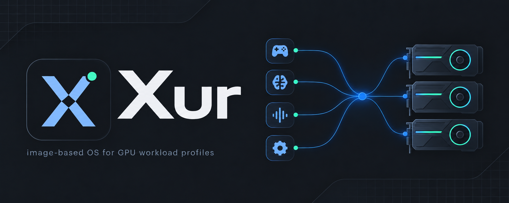
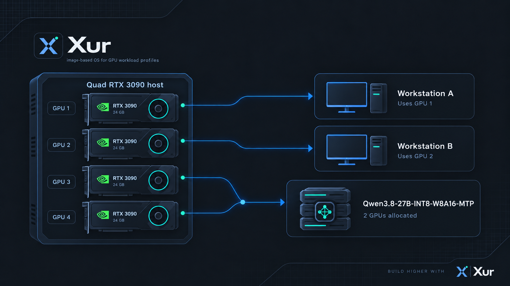
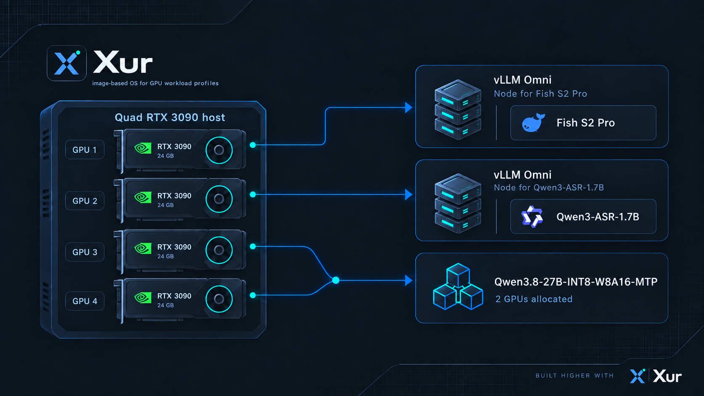

Xur is [MIT-licensed open source](LICENSE).

Xur turns a GPU-equipped PC into a server you manage from a browser. Save profiles
that allocate GPUs to gaming desktops, language models, speech services, and
containers, then switch between those profiles from a single control panel.

Xur uses the upstream Bazzite KDE NVIDIA-open operating system, with a separate,
signed application bundle for its web interface and workload manager.

**Status: preview development.** Single-workstation gaming and Moonlight streaming
have been exercised on RTX 3090 hardware. Multiple workstations and USB/hub
assignment are implemented; physical isolation and reboot acceptance testing are
still in progress. See [current documentation and validation status](docs/README.md)
and [multiseat validation](docs/architecture/multiple-workstations.md).

[Getting started](docs/usage/getting-started.md) ·
[Releases](https://github.com/DouglasCleghorn/Xur/releases) ·
[Build from source](docs/development/build.md) ·
[Report an issue](https://github.com/DouglasCleghorn/Xur/issues)

## What you can do

- **Switch workload profiles.** Independent workloads load and unload in parallel.
  A failed workload does not discard successful siblings; resume retries unfinished
  work, and cancel stops queued work.
- **Run local or streamed desktops.** Assign a GPU and user to each workstation.
  Sunshine streams to Moonlight with required encryption. Named workstations keep
  pairing across profile changes, including GPU reassignment.
- **Assign peripherals.** Choose USB devices or a hub and its supported input/audio
  descendants. Unique serial numbers follow port moves; devices without reliable
  serials use their physical connection. A primary workstation receives unassigned
  input and built-in audio.
- **Serve and test models.** Browse downloaded models, scan attached storage, copy
  active LLM endpoint URLs, test chat, and retain benchmark results with workload
  and sampled VRAM context. Model data persists between reboots.
- **Manage the host.** Monitor GPUs, NVLink, storage and network usage; browse files;
  configure time, HF credentials, API keys, and backups; apply app and OS updates.

## Example profiles

A four-GPU machine can allocate one GPU to each desktop and the remaining pair
to a language model:



Another profile can allocate those GPUs to speech and language workloads:



These diagrams illustrate allocation ideas. Exact model, quantization, engine and
GPU compatibility must be checked for the selected recipe. They are not benchmark
results. GPU allocations are exclusive; NVLink does not make separate cards one
shared memory pool for every application.

## Quick start

1. **Prepare the host.** Use an x86-64 UEFI machine and a target disk of at least
   64 GiB. Internet access is required by the online installer. Build the ISO using
   the [build guide](docs/development/build.md), or use installer media when offered
   with a release.
2. **Install from the console.** Boot the ISO and use **Setup and installation**
   to save the server name, configure Ethernet or Wi-Fi, and review the target
   disk. Type its erase confirmation. **The selected disk is erased.**
   Reboot when the Bazzite download and installation finish. Wi-Fi settings persist.
3. **Create the required account.** After reboot, open the displayed HTTPS address
   on port **8443**, accept the machine's self-signed certificate, and enter the
   console token. Create the administrator account in your browser; Chrome or your
   password manager can suggest and save a strong password. Tailscale is available
   after installation.
4. **Create a profile.** Open **Profiles**, add a workstation or model workload,
   select its GPUs, and save. Use the expanded profile picker on **Home** to load it.
   The first model start downloads its pinned engine and model files.
5. **Use it.** Open **Workstations** for Moonlight pairing and launch instructions,
   **LLM endpoints** for client URLs, or **Model lab** for test chat and benchmarks.

Follow the [complete guide](docs/usage/getting-started.md) for persistent desktop
users, headless streaming, USB assignment, API authentication, and updates.

## Documentation

| Task | Guide |
| --- | --- |
| Install and write USB media | [Installation](docs/usage/install.md), [Rufus](docs/usage/rufus.md) |
| Workstation identity and Moonlight | [Named workstations](docs/usage/workstation-identities.md), [workstations and models](docs/usage/workstations-and-models.md) |
| Profiles and inference APIs | [Profiles](docs/usage/profiles.md), [API keys](docs/usage/api-keys.md) |
| Model selection | [Model catalog](docs/usage/model-catalog.md) |
| Files, storage and GPUs | [File management](docs/usage/files.md), [Storage](docs/usage/storage.md), [GPU monitoring](docs/usage/gpu-monitoring.md) |
| Updates and local builds | [OS updates](docs/usage/updates.md), [application updates](docs/usage/application-updates.md) |
| Security boundaries | [Request security](docs/architecture/request-security.md), [multiple workstations](docs/architecture/multiple-workstations.md) |

## Development

See the [build prerequisites](docs/development/build.md) before building media.
For an existing development environment:

```bash
bash eng/test-fast.sh
./eng/package-update.sh --build-only --version 0.1.0
```

The second command signs and publishes to the **local development update
repository**; it does not publish a GitHub release. Choose a new version for each
build. Enable **Settings → Update channel → Local build testing** on a test server to use it.
GitHub publication is a [separate explicit step](docs/usage/application-updates.md).

Build artifacts live in `dist/`; private runtime state, VM disks, logs and test
captures live under `.build/`. Neither belongs in Git. Docker Hub images must use
Google's mirror as described in [repository rules](AGENTS.md).

The public project site and short guides live in [`website/`](website/README.md),
configured for Cloudflare Workers Static Assets at **xur.app**, without a Worker script. Release candidates build on every push
to `main` (Nightly) or `release` (Stable) and require maintainer approval in GitHub
before publication. See [release channels](docs/usage/application-updates.md).

## License

Xur is available under the [MIT License](LICENSE). Third-party software, fonts,
container images and model weights retain their own licenses; see
[licensing and notices](docs/licensing.md).
