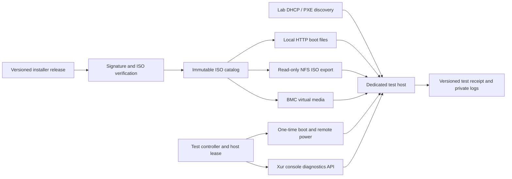

# PXE test server design

Status: initial design, not a deployed service. Start with one controller and one
dedicated GPU test host. The server consumes existing, immutable Xur installer
releases; it does not create a separate installer distribution.

## Use the release ISO as the source

The proposed PXE path is:

1. Download an explicit versioned `*-installer` release and its signed
   `xur-update.json`.
2. Verify the descriptor with Xur's public key and verify the ISO's size/hash
   using `eng/verify-release.py --iso`. Store the ISO under its SHA-256.
3. Read `/images/pxeboot/vmlinuz` and `/images/pxeboot/initrd.img` from that ISO
   without modifying them. Record their hashes and the originating ISO hash.
4. Serve those two boot files through the local boot server. Export the
   **original ISO file**, read-only, over NFS.
5. iPXE loads the kernel/initrd and supplies an `inst.stage2=nfs:.../<file>.iso`
   argument. The release's own initrd mounts the ISO over NFS, finds its
   `LiveOS/squashfs.img`, and starts the bundled Xur installer application.
6. Drive Xur's real console setup API, install to the approved lab SSD, and boot
   the installed system for workload/persistence tests.

The ISO remains byte-for-byte identical to the release. The boot transport and
kernel command line differ from USB boot; record that difference in results.
Keep VM/USB qualification of the ISO's own EFI/GRUB menu as separate coverage.

This choice is grounded in the inspected `nightly-26.10.007-installer` ISO:
its initrd contains the Anaconda NFS `.iso` handling path, NFS support, and
`anaconda_live_root_dir`, which recognizes `LiveOS/squashfs.img` inside an ISO.
Its normal GRUB entry uses `inst.stage2=hd:LABEL=XUR_SETUP_A`. The ISO has no
`.treeinfo`, so serving its contents as an ordinary generic installation tree
must not be assumed to work. The NFS ISO path avoids that dependency. Network
boot still requires end-to-end validation; inspecting these scripts does not
establish that every NIC/firmware combination can boot.

Anaconda documents NFS installation sources, ISO paths, stage-two selection and
network arguments in its [boot options](https://anaconda-installer.readthedocs.io/en/latest/user-guide/boot-options.html).

## Direct media boot where available

For hosts with BMC virtual media, mount the original verified ISO as a read-only
virtual CD/USB device and request a one-time boot through Redfish. This executes
the ISO's original bootloader/menu and lets Linux continue seeing the media.
Use the same artifact catalog and test controller for PXE and virtual-media jobs.
Discover the BMC's supported media resources, boot targets and action URLs rather
than assuming a particular vendor's paths. [Redfish VirtualMedia](https://redfish.dmtf.org/schemas/v1/VirtualMedia.v1_6_5.json)
defines remote media and insertion/ejection actions.

An iPXE HTTP `sanboot` experiment can also try booting the entire ISO directly.
The [iPXE project documents HTTP ISO SAN boot](https://ipxe.org/cmd/sanboot), but
its example is not proof that Xur's UEFI/Linux installer will keep access to the
emulated medium after firmware handoff. Do not make HTTP SAN boot the default
until the release's normal `inst.stage2=hd:LABEL=XUR_SETUP_A` actually finds the
media and reaches Xur. Do not use BIOS MEMDISK as the UEFI boot solution.

## Controller and services



- **Artifact catalog:** verified ISO, signed descriptor, exact boot files and
  extraction manifest. Ingestion finishes atomically before an artifact becomes
  selectable. Existing hashes are immutable; no mutable `latest` URL in a job.
- **Boot service:** dnsmasq or the existing lab DHCP server directs approved UEFI
  hosts to a locally stored iPXE binary and per-job script. Use TFTP for initial
  PXE chainloading or UEFI HTTP Boot where supported. Kernel/initrd transfer uses
  the local HTTP service. [iPXE chainloading](https://ipxe.org/howto/chainloading)
  and [UEFI HTTP chainloading](https://ipxe.org/appnote/uefihttp) describe those entry points.
- **ISO service:** read-only NFS export limited to the lab subnet. Start with
  explicit NFSv4.1 and test that the release initrd mounts it; do not silently
  downgrade protocols if firmware or initrd support is missing.
- **Controller:** owns one exclusive lease per host, generates the boot/config
  material, drives console setup and installed HTTPS APIs, collects results, and
  disarms installation boot before the first installed-system reboot.
- **Power/console adapters:** Redfish where available; otherwise a reviewed
  combination of remote power and serial capture. Wake-on-LAN alone cannot
  recover a hung kernel or select every machine's next boot device.

Keep DHCP isolated on a lab VLAN or a dedicated physical interface. A controller
job must identify a host by its enrolled inventory, not merely a discovered MAC.
Run trusted candidates on the hardware farm; PR source checks stay on disposable
hosted runners. The lab needs DNS, time synchronization and outbound access to
the normal Bazzite/model registries. Serving an ISO locally does not remove the
online Bazzite download or its signature policy.

## Example boot contract

Generate this script for a leased host, using URLs from the artifact catalog.
Addresses below are documentation examples, not a deployable configuration.

```text
#!ipxe
set artifact http://192.0.2.2/boot/ISO_SHA256
kernel ${artifact}/vmlinuz initrd=initrd.img ip=dhcp rd.neednet=1 inst.stage2=nfs:nfsvers=4.1:192.0.2.2:/isos/ISO_SHA256/xur-installer.iso inst.text console=tty1 systemd.unit=multi-user.target xur.installer=1 xur.app-update=off rd.live.ram=0 rd.lvm=0 rd.md=0 rd.luks=0 rd.dm=0
initrd ${artifact}/initrd.img
boot
```

The ISO can retain its release filename on the server; `xur-installer.iso` above
is only an example catalog name for those same bytes. The NFS path is relative
to the proposed NFSv4 export root. Verify that layout in the pilot.

Read and validate the ISO's actual GRUB installer entry when ingesting it. Preserve
its product arguments and make an explicit, recorded replacement of the stage-two
source. Reject an unrecognized layout rather than reusing stale boot arguments.
`xur.app-update=off` selects the ISO's embedded application for the test. Do not
inject a Kickstart that bypasses Xur's disk planning and confirmation.

## Host identity, configuration and erasure

Versioned inventory contains a host ID, expected NIC/MAC, hardware description,
boot/power capabilities, and the **dedicated test SSD's serial and WWN**. Keep
credentials in ignored runtime state. Do not enroll a normal workstation's
system disk as a test target.

The current installer discovers `xur.yml` and `xur-diagnostics.yml` on attached
configuration filesystems. It does not fetch those files from an HTTP URL.
For the pilot, provide a dedicated configuration USB drive, or a second virtual
configuration ISO on a BMC that supports it. Generate/rotate its diagnostic key
and bootstrap code per run. This matches the VM runner's supported mechanism.
Refreshing that medium is an explicit provisioning step; an HTTP configuration
delivery extension would be separate product work, not an assumed capability.

The controller verifies the host and target identity, drives the console's normal
name/network/disk/review screens, validates the erase target again on review,
and sends `confirmErase: true` with the current screen revision. Booting by PXE,
having an answer file, or holding a lease does not itself approve disk erasure.
A timeout on approval stops the job for inspection; it must not resend approval.

Disarm the one-time installation boot before rebooting. Expired or unassigned
hosts leave the network boot path and follow their local firmware boot order.
Never leave an unconditional reinstall script as the default PXE response.

## Jobs, results and implementation order

A job progresses through artifact verification, host reservation, configuration,
boot, console readiness, disk review/approval, installation, installed reboot,
account setup, test execution and cleanup. Installation failure is terminal and
collects diagnostics before reboot. Cancellation releases the boot lease and
collects logs where reachable; it does not start another installation.

Use the VM runner's console/API test steps as the starting acceptance contract.
The hardware suite then adds GPU inference, two-workstation continuity, streaming,
resource release and reboot restoration. USB/audio/display behavior retains
recorded physical acceptance where it cannot be measured automatically.

Results bind the ISO hash, extracted-file hashes, embedded app identity, actual
Bazzite digest, boot transport/arguments, host inventory, driver versions and
test outcomes. Credentials and raw console captures remain private under ignored
`.build/` runtime paths; share only sanitized receipts under `.build/evidence/`.
If screenshots are added, register their capture family and privacy review in
`docs/screenshots.md`. Preserve third-party boot firmware and server software
licenses rather than treating them as Xur MIT code.

Implementation milestones:

1. Prototype iPXE plus NFS ISO boot in a disposable UEFI VM using the verified
   release ISO; validate live-root discovery, configuration media and the exact
   embedded app identity. Test NFS interruption and unavailable media. This is
   a transport qualification, distinct from the USB VM suite.
2. Prove installation boot is one-shot and installed reboot falls back to the
   target disk. Stop/recover a failed job without automatic erasure retries.
3. Add signature-verified ingestion, immutable catalog and the per-host lease API.
4. Enroll one dedicated physical host and implement its power/console adapter.
   Validate NIC/UEFI behavior, then run the same install/persistence contract.
5. Add GPU workloads and a second hardware configuration. Qualify Secure Boot
   separately with the intended boot chain; do not claim support from an ordinary
   OVMF run or disable verification to make a test pass.
